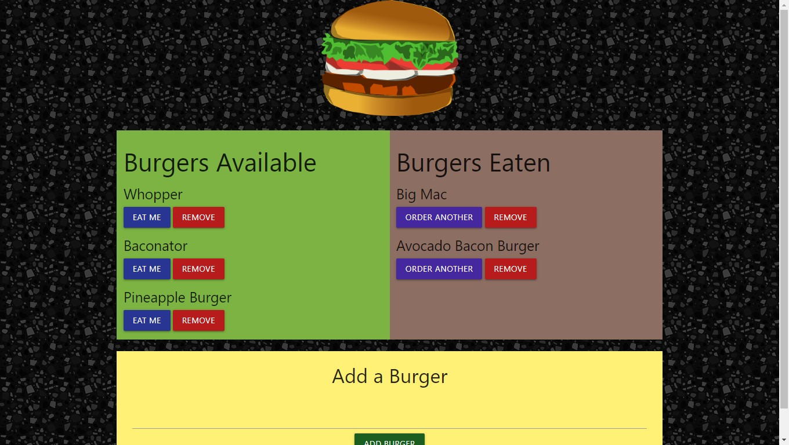

# Note Taker

## What it is

This is a web application that will allow users to add burgers and track if they are eaten or not.

## Where it is

The live deployment is located here: <https://evening-island-97795.herokuapp.com/>

## How to use it

This is a single page application.

To add a burger to the database of available burgers enter the name of the burger in the "Add a Burger" form and click the "ADD BURGER" button.

To eat a burger, click on the "EAT ME" button for any burger in the list of available burgers. This burger will be moved from the available burgers to the eaten burgers.

To re-order a burger, click the "ORDER ANOTHER" button for any burger in the list of eaten burgers. This burger will be moved to the available burgers.

To remove a burger from the database completely click the remove button for any burger.
